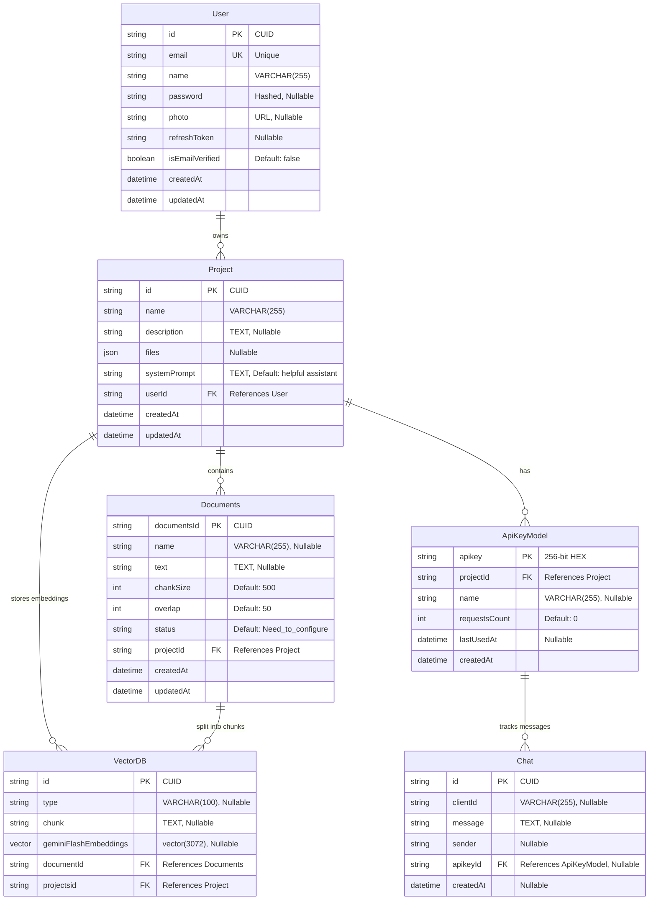

<p align="center">
  
  
  
  
  
  
  
  
</p>

<h1 align="center">🧠 ThinkBase</h1>

<p align="center">
  <strong>An enterprise-grade AI-powered Retrieval-Augmented Generation (RAG) platform that enables businesses and developers to build intelligent, context-aware chatbots from their own documents — deployed to production on Azure.</strong>
</p>

<p align="center">
  <em>Upload your knowledge base → Generate vector embeddings → Deploy an AI chatbot in minutes.</em>
</p>

<p align="center">
  <a href="https://think-base.dev/"></a>
  <a href="https://hasalagayendra.vercel.app/Projects/ThinkBase"></a>
  
</p>

> [!IMPORTANT]
> **This repository is private.** The source code is not publicly available. This README serves as comprehensive technical documentation to demonstrate the architecture, engineering decisions, and full-stack skills behind ThinkBase.
>
> 🌐 **Try the live app →** [https://think-base.dev/](https://think-base.dev/)
>
> 🎬 **Watch demo videos & detailed walkthrough →** [https://hasalagayendra.vercel.app/Projects/ThinkBase](https://hasalagayendra.vercel.app/Projects/ThinkBase)

<br/>

---

## 📋 Table of Contents

- [🎯 What is ThinkBase?](#-what-is-thinkbase)
- [⚡ Key Features](#-key-features)
- [🏗️ System Architecture](#️-system-architecture)
- [🔧 Tech Stack Deep Dive](#-tech-stack-deep-dive)
- [📊 Database Design](#-database-design)
- [🔐 Authentication System](#-authentication-system)
- [🤖 RAG Pipeline — How AI Works](#-rag-pipeline--how-ai-works)
- [📡 API Layer — REST & GraphQL](#-api-layer--rest--graphql)
- [🎨 Frontend Architecture](#-frontend-architecture)
- [📦 SDK — npm Package](#-sdk--npm-package)
- [🚀 CI/CD & Cloud Deployment](#-cicd--cloud-deployment)
- [📁 Project Structure](#-project-structure)
- [🛠️ Skills Demonstrated](#️-skills-demonstrated)
- [👤 About the Developer](#-about-the-developer)

---

## 🎯 What is ThinkBase?

ThinkBase is a **full-stack SaaS platform** that solves a critical problem: _How can businesses create AI chatbots that understand their specific documents and data?_

### The Problem

Generic AI chatbots (like raw ChatGPT) don't know about your company's products, policies, or documentation. They hallucinate answers because they lack context.

### The Solution

ThinkBase uses **Retrieval-Augmented Generation (RAG)** to:

1. **Ingest** your documents (PDFs, text files)
2. **Chunk & embed** them into high-dimensional vectors using Google's `gemini-embedding-001`
3. **Store** embeddings in PostgreSQL with the `pgvector` extension
4. **Retrieve** the most relevant context using cosine similarity search
5. **Generate** accurate, grounded AI responses using `Gemini 2.5 Flash`

> 💡 Think of it as **"Build your own AI assistant that actually knows your stuff"** — with a full dashboard, API keys, and an embeddable SDK widget.

---

## ⚡ Key Features

| Feature                            | Description                                                                                                            |
| ---------------------------------- | ---------------------------------------------------------------------------------------------------------------------- |
| 🔐 **Multi-Strategy Auth**         | Email/password signup with magic-link email verification, Google OAuth 2.0, GitHub OAuth                               |
| 📄 **Document Management**         | Upload, chunk, and manage documents per project with configurable chunk sizes & overlap                                |
| 🧠 **Vector Embeddings**           | Automatic text splitting via `RecursiveCharacterTextSplitter` + `gemini-embedding-001` for 3072-dimensional embeddings |
| 🔍 **Semantic Search**             | Cosine similarity search (`<=>` operator) on `pgvector` to find the top-5 most relevant chunks                         |
| 💬 **AI Chat with Memory**         | Full conversation memory using LangChain message history (`HumanMessage`, `AIMessage`, `SystemMessage`)                |
| 🔑 **API Key System**              | Generate/revoke API keys per project with request counting and usage tracking                                          |
| 🎨 **Customizable System Prompts** | Per-project AI personality and behavior configuration                                                                  |
| 📦 **npm SDK**                     | Published `thinkbase` npm package — embed a chat widget in any website with 3 lines of code                            |
| 📊 **GraphQL API**                 | Apollo Server with auto-generated schema for mobile app consumption                                                    |
| 📝 **Swagger Docs**                | Interactive API documentation at `/api` endpoint                                                                       |
| 🐳 **Docker Multi-Stage Builds**   | Optimized production images for both backend and frontend                                                              |
| 🚀 **CI/CD Pipeline**              | GitHub Actions → Docker Hub → Azure Container Apps (fully automated)                                                   |
| 🎮 **Live Playground**             | Test your chatbot directly in the dashboard before deploying                                                           |
| 📱 **Mobile API Ready**            | GraphQL resolvers designed for React Native mobile app integration                                                     |

---

## 🏗️ System Architecture

```
┌─────────────────────────────────────────────────────────────────────────┐
│                          THINKBASE ARCHITECTURE                        │
├─────────────────────────────────────────────────────────────────────────┤
│                                                                         │
│  ┌──────────────┐   ┌──────────────┐   ┌──────────────────────────┐    │
│  │   Frontend    │   │   SDK npm     │   │   Mobile App (GraphQL)  │    │
│  │  Next.js 15   │   │  "thinkbase"  │   │   React Native Ready   │    │
│  │  React 19     │   │  Rollup Build │   │   Apollo Client         │    │
│  │  Port: 4000   │   │  Any Website  │   │                         │    │
│  └──────┬───────┘   └──────┬───────┘   └───────────┬──────────────┘    │
│         │                   │                       │                   │
│         ▼                   ▼                       ▼                   │
│  ┌──────────────────────────────────────────────────────────────────┐   │
│  │                    BACKEND — NestJS 11                           │   │
│  │                    Port: 3000                                    │   │
│  │                                                                  │   │
│  │  ┌──────────┐ ┌──────────┐ ┌──────────┐ ┌───────────────────┐   │   │
│  │  │   Auth   │ │ Project  │ │   Chat   │ │  Mobile App       │   │   │
│  │  │  Module  │ │  Module  │ │  Module  │ │  Module (GraphQL) │   │   │
│  │  └────┬─────┘ └────┬─────┘ └────┬─────┘ └────────┬──────────┘   │   │
│  │       │             │            │                │              │   │
│  │  ┌────▼─────────────▼────────────▼────────────────▼──────────┐   │   │
│  │  │              Prisma ORM (Type-Safe Database Queries)       │   │   │
│  │  └──────────────────────────┬─────────────────────────────────┘   │   │
│  └─────────────────────────────┼────────────────────────────────────┘   │
│                                │                                        │
│  ┌─────────────────────────────▼────────────────────────────────────┐   │
│  │              PostgreSQL + pgvector Extension                     │   │
│  │  ┌──────┐ ┌─────────┐ ┌──────────┐ ┌─────────────┐ ┌────────┐  │   │
│  │  │ User │ │ Project │ │ VectorDB │ │  Documents  │ │  Chat  │  │   │
│  │  └──────┘ └─────────┘ └──────────┘ └─────────────┘ └────────┘  │   │
│  └──────────────────────────────────────────────────────────────────┘   │
│                                                                         │
│  ┌──────────────────────────────────────────────────────────────────┐   │
│  │                    EXTERNAL SERVICES                             │   │
│  │  🤖 Google Gemini 2.5 Flash (LLM)                               │   │
│  │  🧠 Gemini Embedding 001 (3072-dim vectors)                     │   │
│  │  📧 Gmail SMTP (Nodemailer)                                     │   │
│  │  🔑 Google OAuth 2.0 + GitHub OAuth                             │   │
│  └──────────────────────────────────────────────────────────────────┘   │
│                                                                         │
│  ┌──────────────────────────────────────────────────────────────────┐   │
│  │                    DEPLOYMENT — Azure Cloud                      │   │
│  │  GitHub Actions → Docker Hub → Azure Container Apps              │   │
│  │  Backend Container (Port 3000) + Frontend Container (Port 4000)  │   │
│  └──────────────────────────────────────────────────────────────────┘   │
└─────────────────────────────────────────────────────────────────────────┘
```

---

## 🔧 Tech Stack Deep Dive

### Backend

| Technology          | Version   | Purpose                                                                       |
| ------------------- | --------- | ----------------------------------------------------------------------------- |
| **NestJS**          | 11        | Enterprise Node.js framework — modular architecture with dependency injection |
| **Prisma ORM**      | 6         | Type-safe database client with migrations, schema-first design                |
| **PostgreSQL**      | —         | Primary relational database with `pgvector` for vector similarity search      |
| **LangChain**       | 0.3       | AI orchestration — text splitting, embeddings, message management             |
| **Google Gemini**   | 2.5 Flash | Large Language Model for AI chat responses                                    |
| **Passport.js**     | 0.7       | Authentication middleware — Google, GitHub, JWT strategies                    |
| **Apollo Server**   | 5         | GraphQL API server with auto-generated schema                                 |
| **Swagger**         | 11        | Interactive REST API documentation                                            |
| **Nodemailer**      | 7         | Transactional email service for magic-link verification                       |
| **bcrypt**          | 6         | Password hashing with salt rounds                                             |
| **class-validator** | 0.14      | Request DTO validation with decorators                                        |

### Frontend

| Technology         | Version | Purpose                                         |
| ------------------ | ------- | ----------------------------------------------- |
| **Next.js**        | 15.5    | React framework with App Router, Turbopack, SSR |
| **React**          | 19.1    | UI component library                            |
| **Tailwind CSS**   | 4       | Utility-first CSS framework                     |
| **Zustand**        | 5       | Lightweight global state management             |
| **GSAP**           | 3.13    | Professional-grade animations                   |
| **Framer Motion**  | 12      | React animation library                         |
| **Radix UI**       | —       | Accessible headless UI components               |
| **Axios**          | 1.12    | HTTP client for API communication               |
| **react-dropzone** | 14      | Drag & drop file upload                         |
| **Zod**            | 4       | Runtime type validation                         |

### SDK (`thinkbase` npm package)

| Technology | Purpose                                   |
| ---------- | ----------------------------------------- |
| **Rollup** | Module bundler for tree-shakeable builds  |
| **Babel**  | JSX transpilation for React components    |
| **Axios**  | HTTP client for backend API communication |

### DevOps & Infrastructure

| Technology               | Purpose                          |
| ------------------------ | -------------------------------- |
| **Docker**               | Multi-stage containerized builds |
| **GitHub Actions**       | CI/CD pipeline automation        |
| **Azure Container Apps** | Serverless container hosting     |
| **Docker Hub**           | Container registry               |

---

## 📊 Database Design

The database uses **PostgreSQL with the pgvector extension** for native vector similarity search. Here's the complete Entity-Relationship model:



### Key Design Decisions

| Decision                     | Reasoning                                                                                             |
| ---------------------------- | ----------------------------------------------------------------------------------------------------- |
| **pgvector `vector(3072)`**  | Gemini `embedding-001` outputs 3072-dimensional vectors; pgvector stores these natively in PostgreSQL |
| **Cosine Distance (`<=>`)**  | Used for semantic similarity search — finds chunks closest in meaning, not just keyword matching      |
| **Document status workflow** | `Need_to_configure` → `Processed` — tracks the embedding pipeline state                               |
| **API key as primary key**   | 256-bit hex string via `crypto.randomBytes(32)` — eliminates separate ID column                       |
| **Client ID via cookies**    | Anonymous chat sessions tracked with `httpOnly` secure cookies                                        |
| **Prisma transactions**      | All embedding operations wrapped in transactions with 30-minute timeout for large documents           |

---

## 🔐 Authentication System

ThinkBase implements a **multi-strategy authentication system** with dual-token security:

### Authentication Flow

```
┌─────────────────────────────────────────────────────────────────┐
│                    AUTHENTICATION STRATEGIES                     │
├─────────────┬──────────────┬──────────────┬─────────────────────┤
│  Credentials │  Google OAuth │ GitHub OAuth │  Magic Link Email  │
│  (email+pwd) │    (Passport) │  (Passport)  │  (JWT + Nodemailer)│
└──────┬──────┴──────┬───────┴──────┬───────┴─────────┬───────────┘
       │             │              │                  │
       ▼             ▼              ▼                  ▼
┌──────────────────────────────────────────────────────────────────┐
│                     JWT TOKEN MANAGEMENT                         │
│                                                                  │
│  Access Token  ──▶ Short-lived (5 min), sent via Authorization   │
│  Refresh Token ──▶ Long-lived (7 days), stored in httpOnly       │
│                    secure cookie (SameSite=None)                  │
│                                                                  │
│  Token Rotation: When access token expires, guard automatically  │
│  verifies refresh token and issues new access + refresh tokens   │
└──────────────────────────────────────────────────────────────────┘
```

### How Each Strategy Works

**1. Email/Password Signup**

- User submits email + password
- Password hashed with `bcrypt` (salt rounds auto-generated)
- JWT magic-link token created (expires in **2 minutes**)
- Verification email sent via Gmail SMTP (Nodemailer)
- User clicks link → magic-link validated → `isEmailVerified = true`
- Refresh token issued, stored in `httpOnly` secure cookie

**2. Google OAuth 2.0**

- Passport `GoogleStrategy` redirects to Google consent screen
- On callback: upsert user in database (create if new, update if existing)
- Auto-verifies email (`isEmailVerified = true`)
- Issues refresh token → stores in database + cookie
- Redirects to `/Dashboard`

**3. GitHub OAuth**

- Same flow as Google but using `passport-github2`
- Extracts email and profile from GitHub API
- Auto-creates account on first login

**4. Magic Link Re-Send**

- Decodes expired JWT to extract userId/email
- Issues fresh 2-minute token
- Re-sends verification email

### Guard System (Authorization)

The `VerifyAuthGuard` implements a **two-phase verification**:

```
Phase 1: Try Access Token
  ├─ Valid? → Grant access immediately
  └─ Expired? → Fall through to Phase 2

Phase 2: Try Refresh Token (from cookie)
  ├─ Valid? → Issue new Access Token + rotate Refresh Token
  │          → Set new refresh cookie
  │          → Grant access
  └─ Invalid/Expired? → Deny access (return false)
```

---

## 🤖 RAG Pipeline — How AI Works

This is the core intelligence of ThinkBase. Here's the complete RAG flow:

### Phase 1: Document Ingestion & Embedding

```
                           DOCUMENT INGESTION PIPELINE
  ┌─────────────┐     ┌──────────────────────┐     ┌───────────────────────┐
  │  User       │     │  RecursiveCharacter   │     │  Google Gemini        │
  │  Uploads    │────▶│  TextSplitter         │────▶│  embedding-001        │
  │  Document   │     │  (configurable chunk  │     │  3072-dim vectors     │
  │  (PDF/Text) │     │   size & overlap)     │     │                       │
  └─────────────┘     └──────────────────────┘     └───────────┬───────────┘
                                                                │
  ┌─────────────────────────────────────────────────────────────▼──────────┐
  │                    PostgreSQL + pgvector                                │
  │                                                                        │
  │  INSERT INTO "VectorDB" (id, type, chunk, geminiFlashEmbeddings, ...)  │
  │  VALUES ('hex_id', 'text', 'chunk_text', '[0.012, -0.034, ...]')       │
  │                                                                        │
  │  ► Wrapped in Prisma $transaction (30-min timeout)                     │
  │  ► Document status: Need_to_configure → Processed                     │
  └────────────────────────────────────────────────────────────────────────┘
```

### Phase 2: Chat & Retrieval

```
                              RAG CHAT PIPELINE
  ┌──────────┐
  │  User    │
  │  Message │
  └────┬─────┘
       │
       ▼
  ┌────────────────────────────────────────────────────────────────┐
  │  Step 1: Embed the user's question                            │
  │  ─────────────────────────────────────                        │
  │  • Split user message with RecursiveCharacterTextSplitter     │
  │  • Generate embedding for each chunk via gemini-embedding-001 │
  └────────────────────────┬───────────────────────────────────────┘
                           │
                           ▼
  ┌────────────────────────────────────────────────────────────────┐
  │  Step 2: Vector Similarity Search                             │
  │  ─────────────────────────────────                            │
  │  SELECT chunk, geminiFlashEmbeddings <=> '[query_vector]'     │
  │    AS distance                                                │
  │  FROM "VectorDB"                                              │
  │  WHERE projectsid = 'project_id'                              │
  │  ORDER BY distance ASC                                        │
  │  LIMIT 5                                                      │
  │                                                               │
  │  ► Only chunks with distance < 0.6 are used (relevance gate)  │
  └────────────────────────┬───────────────────────────────────────┘
                           │
                           ▼
  ┌────────────────────────────────────────────────────────────────┐
  │  Step 3: Build LangChain Message Array                        │
  │  ─────────────────────────────────                            │
  │  [                                                            │
  │    SystemMessage(project.systemPrompt + formatting rules),    │
  │    ...previousChatHistory (HumanMessage / AIMessage),         │
  │    HumanMessage("Context: [retrieved chunks]\n\nQ: [query]") │
  │  ]                                                            │
  └────────────────────────┬───────────────────────────────────────┘
                           │
                           ▼
  ┌────────────────────────────────────────────────────────────────┐
  │  Step 4: LLM Invocation                                       │
  │  ─────────────────────                                        │
  │  ChatGoogleGenerativeAI({                                     │
  │    model: 'gemini-2.5-flash',                                 │
  │    temperature: 0,         // Deterministic responses          │
  │    maxRetries: 2           // Auto-retry on failure            │
  │  }).invoke(messages)                                          │
  └────────────────────────┬───────────────────────────────────────┘
                           │
                           ▼
  ┌────────────────────────────────────────────────────────────────┐
  │  Step 5: Persist & Respond                                    │
  │  ──────────────────────                                       │
  │  • Save both user message + AI response to Chat table         │
  │  • Increment API key requestsCount                            │
  │  • Update lastUsedAt timestamp                                │
  │  • Return { aiMessage, timestamp } to client                  │
  └────────────────────────────────────────────────────────────────┘
```

---

## 📡 API Layer — REST & GraphQL

### REST API Endpoints (Swagger-documented)

#### Auth Module (`/auth`)

| Method | Endpoint                     | Description                                   | Auth     |
| ------ | ---------------------------- | --------------------------------------------- | -------- |
| `POST` | `/auth/signup`               | Register with email, name, password           | ❌       |
| `POST` | `/auth/login`                | Login with credentials → sets refresh cookie  | ❌       |
| `POST` | `/auth/logout`               | Clear refresh token cookie                    | ❌       |
| `POST` | `/auth/verify`               | Verify JWT + get user info                    | ✅ Guard |
| `GET`  | `/auth/google`               | Initiate Google OAuth flow                    | ❌       |
| `GET`  | `/auth/google/callback`      | Google OAuth callback → redirect to Dashboard | ❌       |
| `GET`  | `/auth/github`               | Initiate GitHub OAuth                         | ❌       |
| `GET`  | `/auth/github/callback`      | GitHub OAuth callback → redirect to Dashboard | ❌       |
| `POST` | `/auth/magic-link/validate`  | Validate email magic link token               | ❌       |
| `POST` | `/auth/reSendEmail`          | Resend verification email                     | ❌       |
| `POST` | `/auth/homePageVerification` | Check if user is logged in (via cookie)       | ❌       |

#### Project Module (`/project`) — Protected by `ProjectGuard`

| Method | Endpoint                               | Description                       |
| ------ | -------------------------------------- | --------------------------------- |
| `POST` | `/project/createProject`               | Create new RAG project            |
| `POST` | `/project/getProjects/userId`          | Get all projects for a user       |
| `POST` | `/project/document/upload`             | Upload documents (50MB limit)     |
| `POST` | `/project/documents/getall`            | List all documents for a project  |
| `POST` | `/project/documents/getAll/forConfig`  | Get unconfigured documents        |
| `POST` | `/project/updatedDocuments/emberdings` | Trigger embedding pipeline        |
| `POST` | `/project/update/systemPrompt`         | Update AI system prompt           |
| `POST` | `/project/apikeys/create`              | Generate new API key              |
| `POST` | `/project/apikeys/getall`              | List all API keys                 |
| `POST` | `/project/apikeys/detele`              | Revoke an API key                 |
| `POST` | `/project/document/delete`             | Delete document + its vectors     |
| `POST` | `/project/delete`                      | Delete entire project (cascading) |

#### Chat Module (`/chat`) — Protected by `ChatGuard`

| Method | Endpoint                            | Description                               |
| ------ | ----------------------------------- | ----------------------------------------- |
| `POST` | `/chat/sendMessage`                 | Send message → RAG pipeline → AI response |
| `POST` | `/chat/getAllMessagesByClientId`    | Get chat history for client               |
| `POST` | `/chat/deleteAllMessagesByClientId` | Clear chat history                        |

### GraphQL API (Apollo Server)

Available at `/graphql` with auto-generated schema:

```graphql
type Query {
  getUsers: [User!]!
  getAlltProjects: [Project!]!
}

type Mutation {
  getEachUser(data: UserId!): User!
  getEachProject(data: ProjectId!): Project!
}

type User {
  id: String
  email: String
  name: String
  photo: String
  createdAt: DateTime
  _count: ProjectCount
  projects: [Project!]
}

type Project {
  id: String!
  name: String!
  description: String!
  systemPrompt: String!
  fileCount: Float!
  _count: Documents_and_ApiCount
  documents: [Documents!]
  ApiKeyModel: [apiKeys!]
}
```

---

## 🎨 Frontend Architecture

### App Router Structure (Next.js 15)

```
src/app/
├── page.tsx                          # Landing page (SSR)
├── layout.tsx                        # Root layout with nav, auth state
├── globals.css                       # Global styles + Tailwind
├── login/                            # Login page
├── signup/                           # Signup page
├── magic-link/                       # Email verification handler
├── Dashboard/
│   ├── page.tsx                      # Project list view
│   ├── layout.tsx                    # Dashboard layout with sidebar
│   ├── project/                      # Individual project view
│   └── settings/                     # User settings
├── Documentation/                    # API docs page
└── ProductionChatComponentForClient/ # Embeddable chat demo
```

### Component Architecture

```
src/components/
├── LandingPageComponents/          # 10 sections for marketing page
│   ├── HeroSection.tsx             # Hero with animated text
│   ├── WhatIsThinkBase.jsx         # Product explanation
│   ├── Features.tsx                # Feature grid
│   ├── UseCase.tsx                 # Use case showcase
│   ├── StartBuilding.tsx           # CTA section
│   ├── Pricing.tsx                 # Pricing tiers
│   ├── ReadyTo.tsx                 # Final CTA
│   ├── Footer.tsx                  # Site footer
│   └── BetaLabel.tsx               # Beta badge
│
├── Chat.jsx                        # AI chat component (21KB)
├── PlaygroundAndCustomisation.tsx   # Full project management (43KB)
├── ApiKeyGenaration.tsx            # API key CRUD interface
├── DocumentUpload.tsx              # Drag & drop file upload
├── DocumentChunkAdjust.tsx         # Chunk size/overlap config
├── DocumentsList.tsx               # Document management table
├── ConfigureTab.tsx                # Document configuration panel
├── CodeSnippet.tsx                 # SDK integration code display
├── CreateNewProject.tsx            # Project creation modal
├── ProjectCard.tsx                 # Project card component
├── ProjectsSection.tsx             # Projects grid layout
│
├── ui/                             # Shadcn/Radix UI primitives
│   ├── button.tsx
│   ├── card.tsx
│   ├── scroll-area.tsx
│   ├── select.tsx
│   └── slider.tsx
│
└── BlurText.jsx                    # Text animation component
```

### State Management (Zustand)

```typescript
// Global store — lightweight, no boilerplate
interface GlobalStoreState {
  token: string | null;
  userid: string | null;
  useName: string | null;
  userEmail: string | null;
  // + setter functions
}
```

---

## 📦 SDK — npm Package

ThinkBase ships a published **npm package** (`thinkbase`) that lets developers embed an AI chatbot on any website.

### SDK Architecture

```
SDK/
├── src/
│   ├── index.js           # Public exports
│   ├── Client.js          # ThinkBaseClient class (API wrapper)
│   ├── Chat.jsx           # Pre-built React chat widget (22KB)
│   └── HelloWorld.jsx     # Test component
├── rollup.config.js       # Rollup bundler config
├── babel.config.js        # JSX transpilation
└── dist/                  # Built output
```

### `ThinkBaseClient` Class

```javascript
import { ThinkBaseClient } from "thinkbase";

// Initialize with your API key
const client = new ThinkBaseClient({
  apiKey: "your-api-key-here",
  baseUrl: "https://api.think-base.dev", // optional
});

// Send a message and get AI response
const response = await client.sendMessage("What are your return policies?");
// → { aiMessage: "Based on our documents...", time: "2025-...", status: true }

// Get chat history
const messages = await client.getMessages();

// Clear conversation
await client.deleteMessages();
```

### Pre-Built Chat Widget

```jsx
import { Chat } from "thinkbase";

function App() {
  return <Chat apiKey="your-api-key" />;
}
```

---

## 🚀 CI/CD & Cloud Deployment

### Pipeline Architecture

```
┌──────────┐     ┌───────────┐     ┌────────────┐     ┌─────────────────┐
│  GitHub   │────▶│  GitHub   │────▶│  Docker    │────▶│  Azure Container│
│  Push to  │     │  Actions  │     │  Hub       │     │  Apps           │
│  branch   │     │  Workflow │     │  Registry  │     │  (Production)   │
└──────────┘     └───────────┘     └────────────┘     └─────────────────┘
```

### Deployment Steps (Automated)

1. **Trigger**: Push to `deployement_t1` branch
2. **Checkout**: Pull latest code
3. **Azure Login**: Authenticate with service principal
4. **Docker Hub Login**: Authenticate for image push
5. **Build Backend**: `docker build -t hashalagayendra/thinkbase-backend:latest ./backend`
6. **Push Backend**: Push to Docker Hub registry
7. **Deploy Backend**: Update Azure Container App with new image + env vars
8. **Build Frontend**: `docker build --build-arg NEXT_PUBLIC_BACKEND_BASE_URL=... -t hashalagayendra/thinkbase-frontend:latest ./frontend`
9. **Push Frontend**: Push to Docker Hub
10. **Deploy Frontend**: Update Azure Container App for frontend

### Docker Multi-Stage Builds

**Backend (2-stage):**

```
Stage 1 (Builder): node:22-alpine
  → npm install → prisma generate → nest build (1GB memory limit)

Stage 2 (Production): node:22-alpine
  → npm install --only=production → copy dist + prisma client
  → Expose port 3000
```

**Frontend (2-stage):**

```
Stage 1 (Build): node:22-alpine
  → npm install → inject env vars as build args → next build

Stage 2 (Production): node:22-alpine
  → Copy .next + node_modules + public
  → Expose port 4000
```

### Environment Variables (13 secrets)

| Variable                     | Purpose                          |
| ---------------------------- | -------------------------------- |
| `JWT_SECRET`                 | JWT signing key                  |
| `DATABASE_URL`               | PostgreSQL connection (pooled)   |
| `DIRECT_URL`                 | PostgreSQL direct connection     |
| `Gemini_API_KEY`             | Google AI API key                |
| `GOOGLE_CLIENT_ID/SECRET`    | Google OAuth credentials         |
| `GIT_HUB_CLIENT_ID/SECRET`   | GitHub OAuth credentials         |
| `EMAIL_USER/PASS`            | Gmail SMTP for Nodemailer        |
| `FRONTEND_URL / BACKEND_URL` | Service URLs for OAuth redirects |

---

## 📁 Project Structure

```
ThinkBase/
├── .github/
│   └── workflows/
│       └── deploy.yml                # CI/CD: GitHub Actions → Azure
│
├── backend/                          # NestJS 11 API Server
│   ├── src/
│   │   ├── auth/                     # Authentication module
│   │   │   ├── auth.controller.ts    # Auth endpoints (239 lines)
│   │   │   ├── auth.service.ts       # Auth business logic (227 lines)
│   │   │   ├── auth.guard.ts         # Dual-token verification (157 lines)
│   │   │   ├── auth.module.ts        # Module config
│   │   │   ├── strategies/
│   │   │   │   ├── google.strategy.ts
│   │   │   │   └── github.strategy.ts
│   │   │   ├── mailService/
│   │   │   │   └── email.service.ts  # Nodemailer integration
│   │   │   └── giveAccsessSameSiteNone/
│   │   │       └── cookie-options.interceptor.ts
│   │   │
│   │   ├── chat/                     # RAG Chat module
│   │   │   ├── chat.controller.ts    # Chat endpoints
│   │   │   ├── chat.service.ts       # RAG pipeline (299 lines)
│   │   │   ├── chat.guard.ts         # API key validation
│   │   │   └── chat.module.ts
│   │   │
│   │   ├── project/                  # Project management module
│   │   │   ├── project.controller.ts # Project endpoints (166 lines)
│   │   │   ├── project.service.ts    # Project + embedding logic (402 lines)
│   │   │   ├── project.guard.ts      # Project access guard
│   │   │   ├── project.module.ts
│   │   │   └── Dtos/                 # Data Transfer Objects
│   │   │       ├── createProject.dto.ts
│   │   │       ├── uploadDocument.dto.ts
│   │   │       └── getProjectByUserIdAndProjectId.dto.ts
│   │   │
│   │   ├── mobile-app/               # GraphQL API module
│   │   │   ├── mobile-app.resolver.ts
│   │   │   ├── mobile-app.service.ts
│   │   │   ├── mobile-app.module.ts
│   │   │   └── data-types/           # GraphQL type definitions
│   │   │
│   │   ├── user/                     # User module
│   │   │   ├── user.controller.ts
│   │   │   ├── user.service.ts
│   │   │   ├── user.module.ts
│   │   │   └── Dtos/
│   │   │
│   │   ├── prisma/                   # Prisma service
│   │   ├── config/                   # App configuration
│   │   ├── middleware/               # Custom middleware
│   │   ├── app.module.ts             # Root module
│   │   ├── main.ts                   # Bootstrap (Swagger, CORS, pipes)
│   │   └── schema.gql               # Auto-generated GraphQL schema
│   │
│   ├── prisma/
│   │   ├── schema.prisma             # Database schema (6 models)
│   │   └── migrations/               # 14 migration files
│   ├── Dockerfile                    # Multi-stage build
│   └── package.json
│
├── frontend/                         # Next.js 15 Web App
│   ├── src/
│   │   ├── app/                      # App Router pages
│   │   ├── components/               # 18 components + 10 landing page
│   │   ├── store/                    # Zustand global state
│   │   ├── lib/                      # Utility libraries
│   │   └── utils/                    # Helper functions
│   ├── Dockerfile                    # Multi-stage build
│   └── package.json
│
└── SDK/                              # npm package "thinkbase"
    ├── src/
    │   ├── index.js                  # Public exports
    │   ├── Client.js                 # ThinkBaseClient class
    │   └── Chat.jsx                  # Pre-built chat widget
    ├── rollup.config.js
    └── package.json
```

---

## 🛠️ Skills Demonstrated

This project demonstrates proficiency across the **full software development lifecycle**:

### Backend Development

- ✅ **NestJS** — Modular architecture, dependency injection, guards, interceptors, pipes
- ✅ **TypeScript** — Type-safe backend with DTOs, interfaces, and generics
- ✅ **Database Design** — Relational schema design with 6 interconnected models
- ✅ **Prisma ORM** — Schema-first approach, raw queries for pgvector, transactions, migrations
- ✅ **Authentication** — Custom JWT dual-token system, OAuth 2.0 (Google + GitHub), magic-link email
- ✅ **API Design** — RESTful endpoints with Swagger documentation + GraphQL with Apollo
- ✅ **Security** — bcrypt password hashing, httpOnly cookies, CORS configuration, input validation

### AI / Machine Learning

- ✅ **RAG Architecture** — End-to-end retrieval-augmented generation pipeline
- ✅ **LangChain** — Text splitting, embeddings, message management, LLM orchestration
- ✅ **Vector Databases** — pgvector extension, cosine similarity search, embedding storage
- ✅ **LLM Integration** — Google Gemini 2.5 Flash with temperature control and retry logic

### Frontend Development

- ✅ **Next.js 15** — App Router, Turbopack, SSR, client/server components
- ✅ **React 19** — Hooks, state management, component composition
- ✅ **Tailwind CSS 4** — Utility-first styling, responsive design, dark mode
- ✅ **Animations** — GSAP + Framer Motion for professional-grade UI animations
- ✅ **State Management** — Zustand for lightweight, scalable global state

### DevOps & Infrastructure

- ✅ **Docker** — Multi-stage builds for optimized production images
- ✅ **CI/CD** — GitHub Actions pipeline with automated deployment
- ✅ **Azure Cloud** — Container Apps, Container Registry, resource groups
- ✅ **Environment Management** — Secure secrets handling via GitHub Secrets

### Software Engineering Practices

- ✅ **npm Package Publishing** — Built and published `thinkbase` SDK to npm registry
- ✅ **API Key Management** — Secure key generation, revocation, and usage tracking
- ✅ **Modular Architecture** — Clean separation of concerns across modules
- ✅ **Database Migrations** — 14 incremental migrations tracking schema evolution
- ✅ **Multi-Client Support** — REST API for web, GraphQL for mobile, SDK for third-party integration

---

## 👤 About the Developer

**Built entirely by a single developer** as a showcase of full-stack, AI, and cloud engineering skills.

This project demonstrates the ability to:

- Architect and build a **production-ready SaaS platform** from scratch
- Implement complex **AI/ML pipelines** (RAG, vector search, LLM orchestration)
- Design and deploy **cloud-native infrastructure** (Docker, CI/CD, Azure)
- Create **developer tools** (SDK, API keys, Swagger docs, GraphQL)
- Build **polished user interfaces** with modern web technologies

> 🔗 **Live Production App**: Deployed and running on Azure Container Apps  
> 📦 **npm Package**: `thinkbase` — available on npm registry  
> 📝 **API Documentation**: Available at `/api` (Swagger) and `/graphql` (Apollo Playground)

---

<p align="center">
  <strong>⭐ If you found this project impressive, please consider starring the repository!</strong>
</p>

<p align="center">
  
  
</p>
